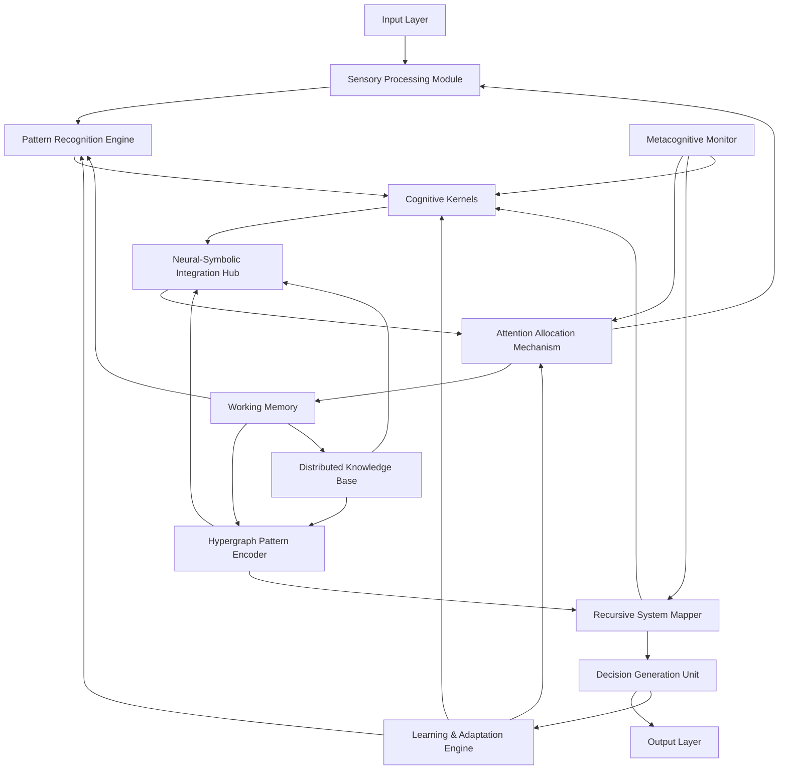
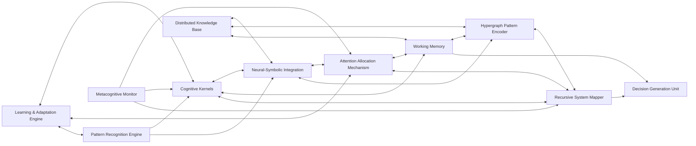
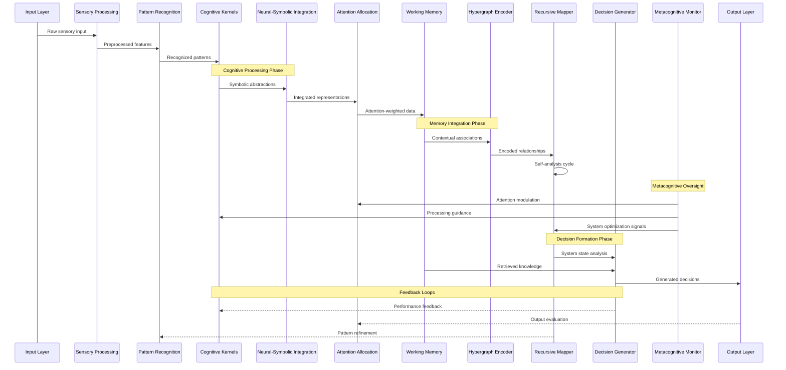
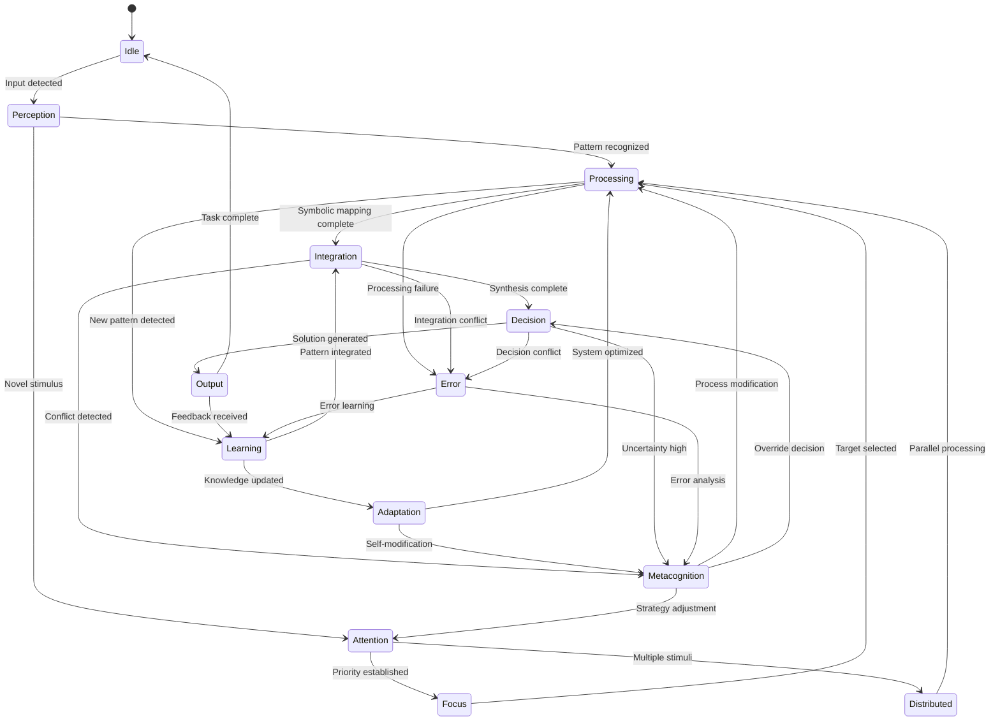
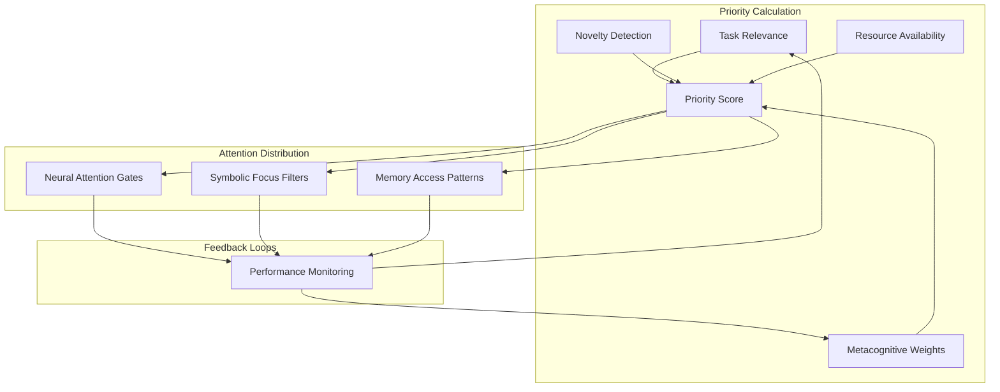

# MORK: Cognitive Architecture Documentation

## Overview

MORK (Metacognitive Orchestration and Recursive Knowledge) is an advanced cognitive architecture that implements neural-symbolic integration through hypergraph pattern encoding and adaptive attention allocation mechanisms. This documentation provides comprehensive architectural insights with visual representations using Mermaid diagrams.

## System Architecture Overview

The following diagram illustrates the high-level system architecture showing principal cognitive flows and emergent patterns:

### Architectural Components Description

- **Input Layer**: Primary sensory input interface supporting multimodal data ingestion
- **Sensory Processing Module**: Raw data preprocessing and feature extraction
- **Pattern Recognition Engine**: Advanced pattern detection using emergent cognitive algorithms
- **Cognitive Kernels**: Core computational units implementing recursive cognitive processes
- **Neural-Symbolic Integration Hub**: Bridges continuous neural representations with discrete symbolic reasoning
- **Attention Allocation Mechanism**: Dynamic resource allocation based on cognitive load and priority
- **Working Memory**: Temporal information storage with associative retrieval capabilities
- **Hypergraph Pattern Encoder**: Complex relationship encoding using hypergraph structures
- **Recursive System Mapper**: Self-referential system analysis and optimization
- **Decision Generation Unit**: Multi-criteria decision synthesis with uncertainty handling
- **Metacognitive Monitor**: Higher-order cognitive oversight and self-regulation
- **Distributed Knowledge Base**: Persistent knowledge storage with dynamic organization
- **Learning & Adaptation Engine**: Continuous system optimization and knowledge acquisition

## Module Interaction Architecture

The following diagram shows bidirectional synergies and inter-module communication patterns:

### Interaction Patterns

- **Bidirectional Synergies**: Each module maintains both input and output channels enabling emergent feedback loops
- **Adaptive Coupling**: Connection strengths dynamically adjust based on cognitive load and task requirements
- **Recursive Dependencies**: Self-referential pathways enable metacognitive awareness and system optimization
- **Emergent Coordination**: Global behavior emerges from local module interactions without centralized control

## Data and Signal Propagation Pathways

The following sequence diagram illustrates the flow of data and signals through the cognitive processing pipeline:

### Signal Processing Characteristics

- **Asynchronous Processing**: Multiple pathways operate concurrently with dynamic synchronization
- **Adaptive Latency**: Processing delays adjust based on complexity and cognitive load
- **Recursive Feedback**: Multi-level feedback loops enable continuous system refinement
- **Emergent Prioritization**: Signal importance emerges from distributed processing rather than predetermined rules

## Cognitive State Management

The following state diagram represents the dynamic cognitive states and transitions within the MORK system:

### State Characteristics

- **Idle**: Baseline state with minimal processing, monitoring for input
- **Perception**: Active sensory processing and initial pattern detection
- **Attention**: Resource allocation and priority management
- **Focus**: Concentrated processing on selected targets
- **Distributed**: Parallel processing of multiple stimuli
- **Processing**: Core cognitive computation within cognitive kernels
- **Integration**: Neural-symbolic integration and relationship encoding
- **Learning**: Knowledge acquisition and pattern refinement
- **Adaptation**: System optimization and parameter adjustment
- **Metacognition**: Higher-order self-reflection and strategy modification
- **Decision**: Solution synthesis and output generation
- **Output**: External communication and action execution
- **Error**: Exception handling and recovery procedures

### Transition Triggers

- **Input-driven**: External stimuli triggering state changes
- **Threshold-based**: Internal parameters reaching critical values
- **Temporal**: Time-based transitions for maintenance and optimization
- **Emergent**: State changes arising from complex system dynamics

## Neural-Symbolic Integration Points

The MORK architecture implements several key integration points where continuous neural representations interface with discrete symbolic reasoning:

### 1. Pattern-Symbol Bridge
Located within the Neural-Symbolic Integration Hub, this component translates detected patterns into symbolic abstractions while maintaining gradient pathways for continuous optimization.

### 2. Attention-Symbol Coupling
The Attention Allocation Mechanism uses symbolic priorities to guide neural attention weights, creating a bidirectional flow between symbolic goals and neural focus.

### 3. Memory-Symbol Interface
Working Memory maintains both neural activation patterns and symbolic knowledge structures, enabling seamless transitions between associative and logical reasoning.

### 4. Recursive Symbol Grounding
The Recursive System Mapper grounds symbolic representations in the system's own architecture, enabling metacognitive symbolic reasoning about neural processes.

## Adaptive Attention Allocation Mechanisms

The attention system in MORK implements several sophisticated mechanisms:

### Dynamic Priority Computation

### Adaptive Mechanisms
- **Contextual Weighting**: Attention priorities adapt based on task context and environmental demands
- **Fatigue Modeling**: Attention resources diminish with use and recover over time
- **Interest Evolution**: Long-term attention patterns influence priority calculations
- **Conflict Resolution**: Multiple competing priorities resolved through metacognitive arbitration

## Cognitive Synergy Optimizations

MORK implements several optimization strategies to enhance cognitive synergies:

### 1. Cross-Modal Integration
Multiple sensory modalities are integrated at the Neural-Symbolic Integration Hub to create richer representations than any single modality could provide.

### 2. Temporal Binding
The Hypergraph Pattern Encoder maintains temporal relationships across extended time horizons, enabling long-range dependency modeling.

### 3. Recursive Enhancement
The Recursive System Mapper continuously analyzes and optimizes inter-module communication pathways, improving overall system efficiency.

### 4. Emergent Coordination
Global coordination emerges from local module interactions without requiring centralized control, enabling robust and adaptive behavior.

## Implementation Pathways

### Recursive Implementation Strategy

The MORK architecture follows a recursive implementation approach where:

1. **Self-Modeling**: Each component maintains models of its own operation
2. **Meta-Learning**: Components learn how to learn more effectively
3. **Self-Optimization**: System continuously refines its own architecture
4. **Emergent Functionality**: Higher-order capabilities emerge from component interactions

### Development Phases

1. **Foundation Phase**: Core cognitive kernels and basic integration
2. **Enhancement Phase**: Advanced attention and memory systems
3. **Metacognitive Phase**: Higher-order reasoning and self-reflection
4. **Emergence Phase**: Complex behavior arising from system interactions

## Future Extensions

The architecture supports several planned extensions:

- **Multi-Agent Coordination**: Integration with other MORK instances
- **Continuous Learning**: Lifelong learning without catastrophic forgetting
- **Emotional Integration**: Affective processing and emotional reasoning
- **Creative Synthesis**: Novel solution generation and creative problem-solving

## Conclusion

The MORK architecture represents a significant advancement in cognitive system design, integrating neural and symbolic approaches through sophisticated attention mechanisms and recursive self-improvement. The comprehensive documentation and visual representations provided here serve as a foundation for distributed cognition among contributors and facilitate continued system evolution.