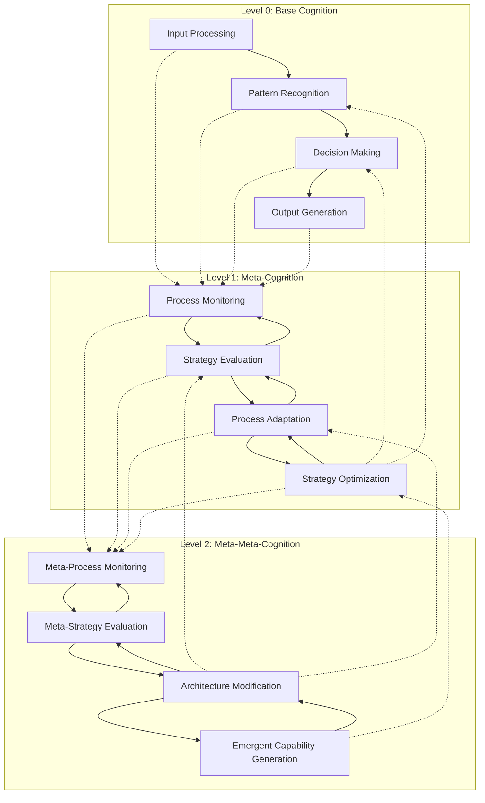
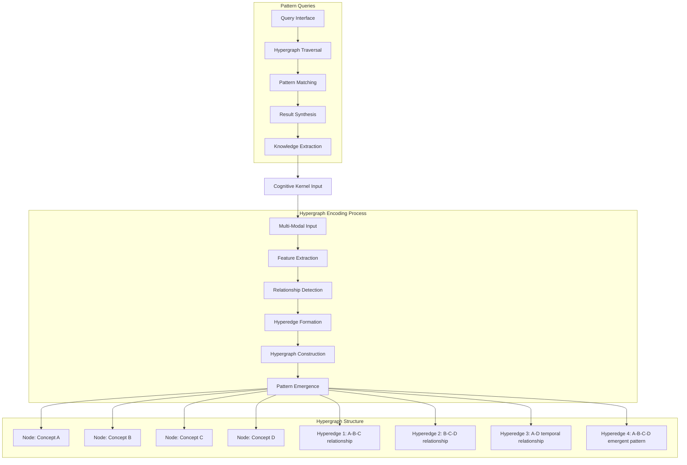
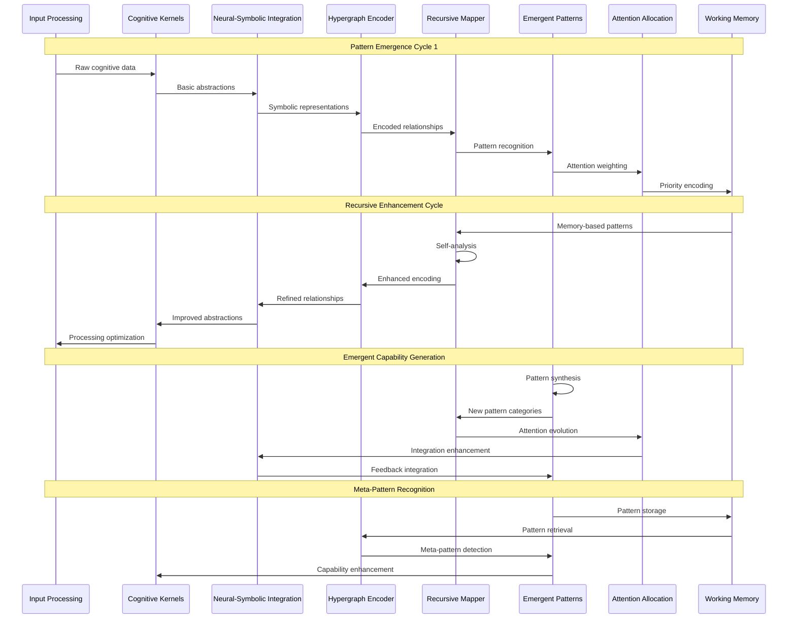
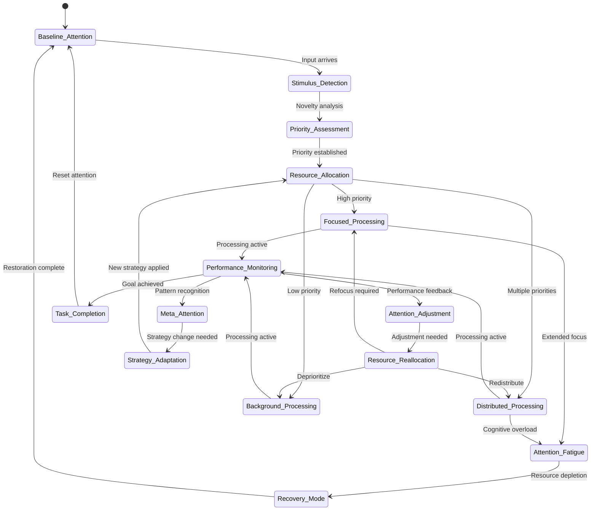
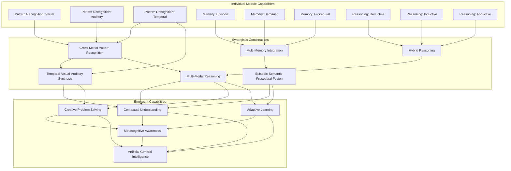
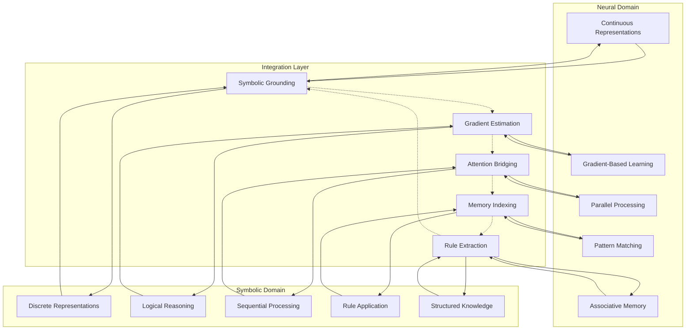
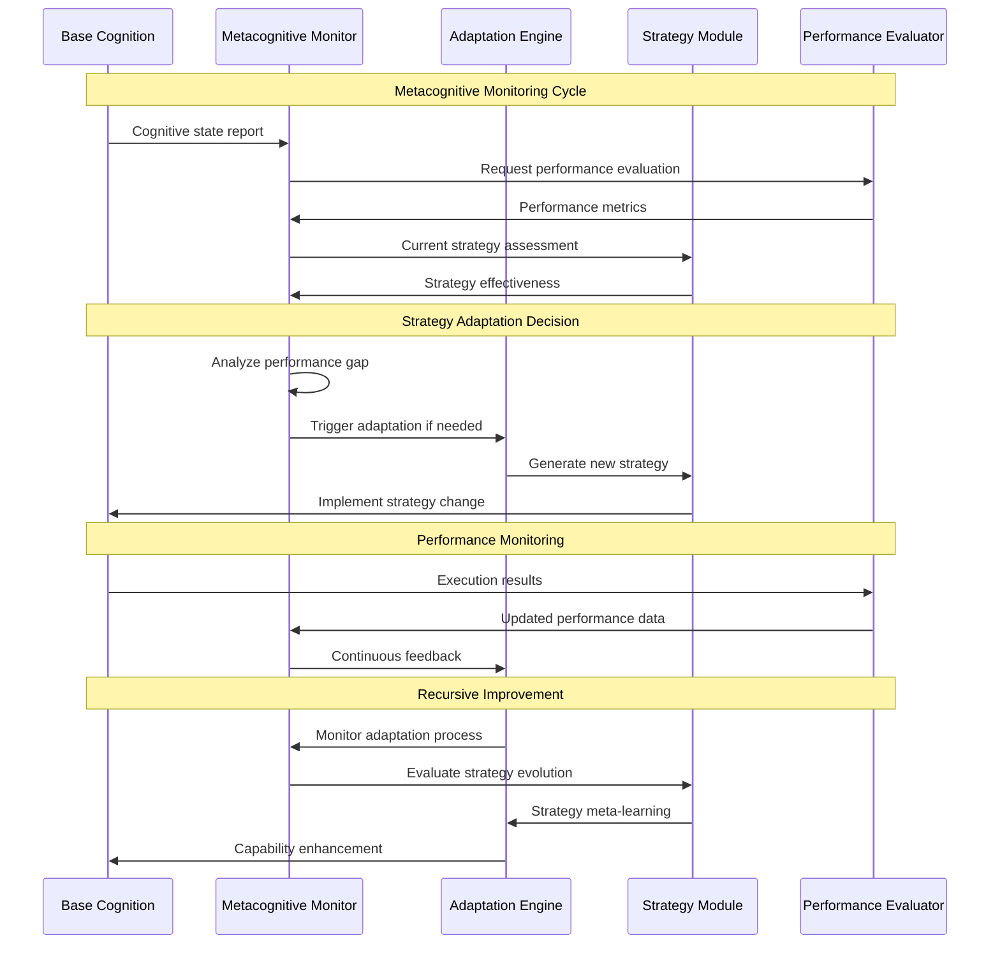
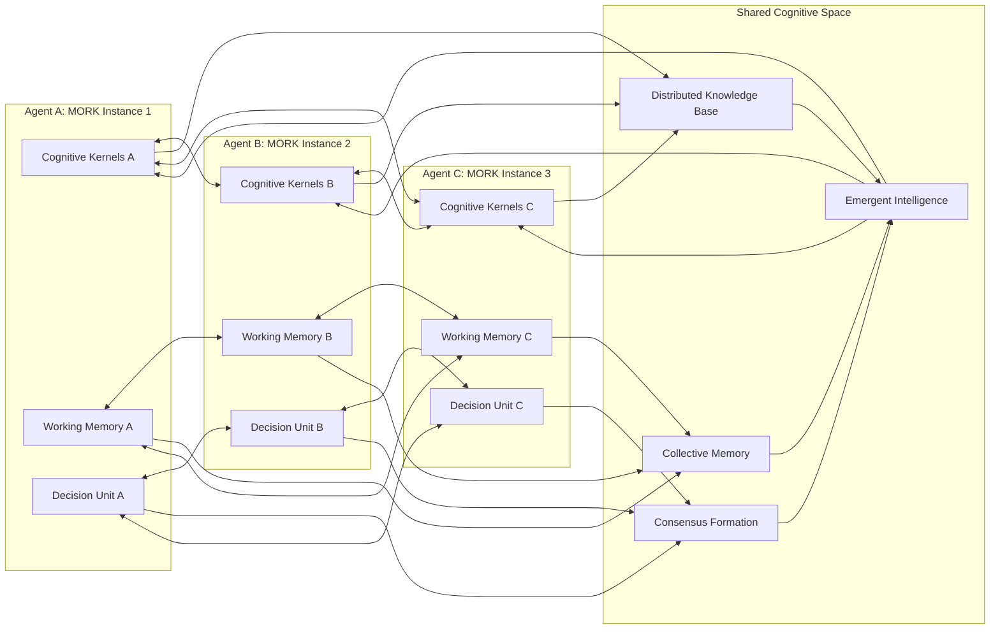
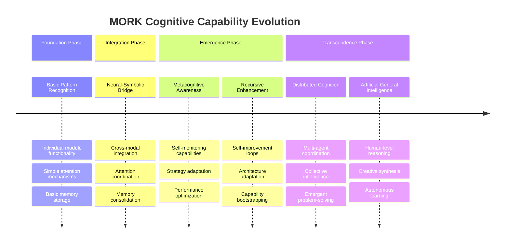

# MORK: Cognitive Flows and Emergent Patterns

## Overview

This document provides an in-depth analysis of the cognitive flows and emergent patterns within the MORK (Metacognitive Orchestration and Recursive Knowledge) architecture. It focuses on the recursive implementation pathways and hypergraph-centric documentation of emergent cognitive behaviors.

## Recursive System Mapping Flows

The following diagram illustrates the recursive nature of system self-analysis and optimization:

### Recursive Mechanisms

1. **Self-Reference Loops**: Each cognitive level monitors and modifies lower levels
2. **Emergent Feedback**: Higher-order patterns influence base-level processing
3. **Adaptive Hierarchies**: The hierarchy itself adapts based on performance
4. **Recursive Optimization**: Optimization strategies optimize themselves

## Hypergraph Pattern Encoding

The MORK system uses hypergraph structures to represent complex, multi-dimensional relationships:

### Hypergraph Advantages

- **Multi-dimensional Relationships**: Capture relationships between multiple entities simultaneously
- **Emergent Pattern Detection**: Complex patterns emerge from hyperedge intersections
- **Flexible Querying**: Support for complex relational queries across multiple dimensions
- **Scalable Representation**: Efficient representation of high-dimensional cognitive spaces

## Emergent Cognitive Pattern Analysis

## Attention Allocation Dynamics

The following diagram shows the dynamic evolution of attention allocation over time:

## Cognitive Synergy Emergence

## Neural-Symbolic Integration Pathways

## Metacognitive Oversight Mechanisms

## Distributed Cognition Coordination

## Emergent Capability Timeline

## Implementation Guidelines

### Recursive Implementation Principles

1. **Start Simple**: Begin with basic recursive loops before complex meta-cognition
2. **Gradual Complexity**: Add layers of recursion incrementally
3. **Stability Monitoring**: Ensure recursive loops don't become unstable
4. **Emergence Detection**: Monitor for unexpected emergent behaviors
5. **Adaptive Boundaries**: Allow system boundaries to evolve with capability

### Hypergraph Encoding Best Practices

1. **Node Abstraction**: Use appropriate abstraction levels for cognitive concepts
2. **Hyperedge Efficiency**: Balance expressiveness with computational efficiency
3. **Pattern Indexing**: Implement efficient indexing for pattern retrieval
4. **Dynamic Growth**: Allow hypergraph structure to grow with experience
5. **Pruning Strategies**: Remove irrelevant or outdated patterns

### Integration Monitoring

1. **Boundary Maintenance**: Monitor neural-symbolic integration boundaries
2. **Gradient Flow**: Ensure gradients flow properly across integration points
3. **Symbol Grounding**: Verify symbolic representations remain grounded
4. **Performance Metrics**: Track integration effectiveness over time
5. **Adaptation Triggers**: Define clear triggers for integration adaptation

## Conclusion

The MORK architecture's recursive and emergent nature represents a significant advancement in cognitive system design. Through careful implementation of hypergraph pattern encoding, adaptive attention allocation, and metacognitive oversight, the system achieves distributed cognition capabilities that facilitate continuous improvement and emergent intelligence.

The documentation provided here serves as a foundation for understanding the complex cognitive flows and implementation pathways necessary for realizing the full potential of the MORK architecture.